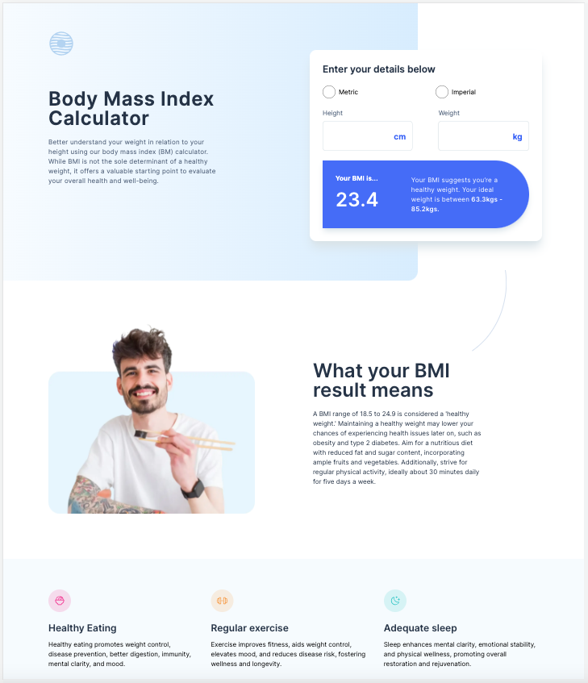

# Frontend Mentor - Body Mass Index Calculator solution

This is a solution to the [Body Mass Index Calculator challenge on Frontend Mentor](https://www.frontendmentor.io/challenges/body-mass-index-calculator-brrBkfSz1T). Frontend Mentor challenges help you improve your coding skills by building realistic projects.

## Table of contents

- [Overview](#overview)
  - [Screenshot](#screenshot)
  - [Links](#links)
- [My process](#my-process)
  - [Built with](#built-with)
- [Author](#author)
- [Acknowledgments](#acknowledgments)

## Overview

### Screenshot



### Links

- Solution URL: [(https://github.com/Kofiastro/Bmi-Calculator)]
- Live Site URL:[(https://gregarious-quokka-48bb4e.netlify.app/)]

## My process

Using Tailwindcss i have been able to work on designs much faster and i want to learn more by working on more projects at frontendmentor to help me be good at it.

### Built with

- TailwindCss with grids and Flexbox
  -vanilla Javascript under development

### What I learned

THis project brought alot of experience throughout my Journey using tailwindcss in addition to Vanilla javascript.I am currently working my way up using javascript for the BMI calculator.Creating the ring button section with forms was something challenging but i was able to figure it out.

```html
<! <div class=" Imperial-form  md:space-x-3   ">
<div class="flex flex-col space-y-5  text-DarkBlue ">
  Height
  <div class="space-x-4 pt-4 pb-4 text-xl font-bold flex  text-black">
    <input
      type="text"
      name="height"
      id="height"
      class="py-5 pl-4 w-1/2 placeholder:px-6 rounded-lg border border-Borders shadow-sm focus:border-Blue focus:outline-none focus:ring-Blue  placeholder:text-end  placeholder:text-Blue placeholder:font-semibold placeholder:text-xl "
      placeholder="ft"
    />
    <input
      type="text"
      name="height"
      id="height"
      class="py-5 pl-4 w-1/2 placeholder:px-6 rounded-lg border border-Borders shadow-sm focus:border-Blue focus:outline-none focus:ring-Blue  placeholder:text-end  placeholder:text-Blue placeholder:font-semibold placeholder:text-xl "
      placeholder="in"
    />
  </div>
  Weight
  <div class="space-x-4 text-xl font-bold flex  text-black">
    <input
      type="text"
      name="height"
      id="height"
      class=" w-1/2 py-5 pl-4 placeholder:px-6 rounded-lg border border-Borders shadow-sm focus:border-Blue focus:outline-none focus:ring-Blue  placeholder:text-end  placeholder:text-Blue placeholder:font-semibold placeholder:text-xl "
      placeholder="st"
    />
    <input
      type="text"
      name="height"
      id="height"
      class=" w-1/2 py-5 pl-4 placeholder:px-6 rounded-lg border border-Borders shadow-sm focus:border-Blue focus:outline-none focus:ring-Blue  placeholder:text-end  placeholder:text-Blue placeholder:font-semibold placeholder:text-xl "
      placeholder="lbs"
    />
  </div>
</div>
```

```css
@tailwind base;
@tailwind components;
@tailwind utilities;

.bg-hero {
  width: 100%;
  height: 800px;
  @apply absolute rounded-b-3xl top-0  bg-gradient-to-r from-white to-heroB;
}

@media screen(md) {
  .bg-hero {
    width: 100%;
    height: 600px;
    @apply absolute rounded-b-3xl top-0  bg-gradient-to-r from-white to-heroB;
  }
}
@media screen(lg) {
  .bg-hero {
    width: 90%;
    height: 700px;
    @apply absolute rounded-b-3xl top-0 ml-6 bg-gradient-to-r from-white to-heroB;
  }
}
.imagez {
  @apply w-20 h-20;
}
#Benefits_Section {
  @apply bg-BackImg;
}
```
## Author

- Frontend Mentor - [@Kofiastro](https://www.frontendmentor.io/profile/kofiastro)

## Acknowledgments

Big thanks to Traversy Media and the frontendmentor team 🎉
